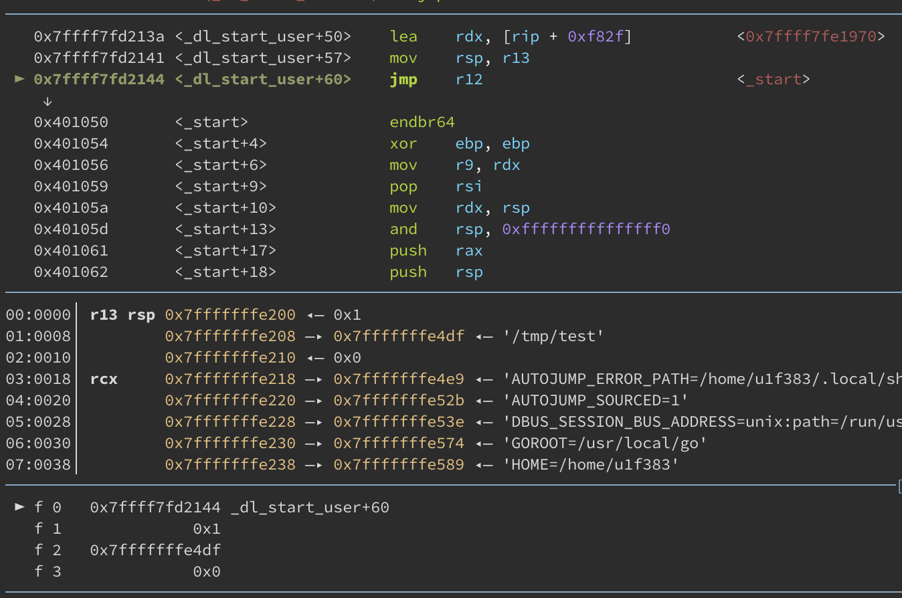
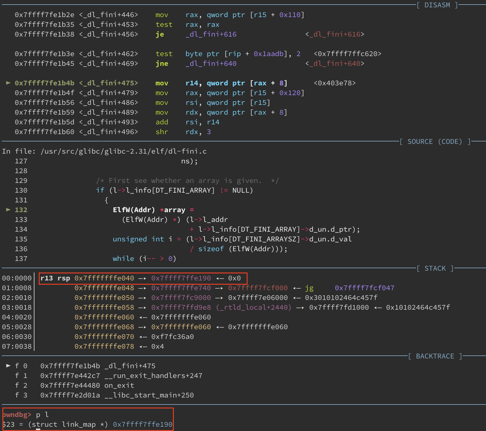

## 非預期解

大致步驟為：

1. leak stack address
2. write fmtstr in global
3. use fsb to overwrite `cnt` or return address


因為 `cnt` 在 `printf()` 的深處仍會將 register 上的值 push 到 stack 上：

```
0x7f9693b13eb2 <printf+162>    mov    dword ptr [rsp + 4], 0x30
0x7f9693b13eba <printf+170>    call   __vfprintf_internal

0x7f9693b289f9 <__vfprintf_internal+25>    push   rbx
0x7f9693b289fa <__vfprintf_internal+26>    sub    rsp, 0x548
```

如果能控制 pointer 指向對應到的 stack 位址，就可以透過 fmt 蓋寫成一個很大的值，之後就是不斷透過 fmt 來做事，像是跳 one gadget 或做 stack pivoting，打法有很多種就不贅述。


## 預期解

一共分成三個步驟：

1. leak libc address
2. write one gadget to variable `global`
3. overwrite `(struct link_map) map[0]` in the stack


可以先以一個簡單程式做示範：

```c
// gcc -Wl,--dynamic-linker=/usr/src/glibc/glibc_dbg/elf/ld.so -no-pie -g -o test test.c
#include <stdio.h>
char globals[0x20] = {0};
int main()
{
    puts("OWO");
    return 0;
}
```

配合 gdb script，載入 debug version library 並且下斷點在 `main()`：

```
set exec-wrapper env "LD_PRELOAD=/usr/src/glibc/glibc_dbg/libc.so"
b main
r
```


此時觀察 stack 中的內容，應該都可以發現有一個位址落在 `ld.so` (dynamic linker library) 下方的記憶體區塊：


而此位址是在 linker 一開始替程式做一些執行的前處理時所留下，如果有興趣的話可以下斷點在 `_dl_init()` 開始追，這邊是 linker 在做初始化環境的程式碼：


最後確實會在某個地方準備執行 `_start()`，也就是 c-runtime：




因此實際上 `_start()` 還不能說是整個程式載入時的第一個進入點，linker 前面還做了一大堆事情。而 `main()` 在 return 後會回到 `<__libc_start_main+243>` (常打 pwn 的應該會對 243 這個數字不陌生)，最後執行 `exit(<return_value>)`，而 `exit()` 在往深入追的話會到 `__run_exit_handlers()`，這個 function 才會真正的去執行某些 segment 的 fini function ([exit.c](https://elixir.bootlin.com/glibc/glibc-2.31/source/stdlib/exit.c))：

1. `__call_tls_dtors()`： tls (thread local storage) 的 destructor，當 thread 結束或是 process exit 時會呼叫到

2. traverse `exit_function_list` 的 while loop： 執行透過 `atexit()` 或 `on_exit()` 所註冊的 function，正常情況下只會有一個 function `_dl_fini()` 會被執行，如果有註冊的會被 insert 在更前面的位置

3. `RUN_HOOK (__libc_atexit, ());`： 變數 `__elf_set___libc_atexit_element__IO_cleanup__` 內會存放一個 function address，而該段程式碼會去執行對應的 function，正常情況下是 `_IO_cleanup()`，也意味著 `exit()` 在最後會執行 flush buffer 之類的行為

   - 這邊 `__elf_set___libc_atexit_element__IO_cleanup__` 會是可寫的，因此這邊也可以作為寫入 one_gadget 的目標，而且剛好滿足：

     ```shell
     0xe6c7e execve("/bin/sh", r15, r12)
     constraints:
       [r15] == NULL || r15 == NULL
       [r12] == NULL || r12 == NULL
     ```


最後會執行 `_exit()`，裡面就單純執行 `sys_exit` 離開程式。


接下來追 `_dl_fini()` 的執行流程 ([dl-fini](https://elixir.bootlin.com/glibc/glibc-2.31/source/elf/dl-fini.c))，這個 function 對應一開始 linker 用來初始化環境的 function `_dl_init()`，主要處理呼叫 loaded objects 的 destructor function，其中由於 process 可能處在多個 namespace，因此 `_dl_fini()` 也會 handle 不同 namespace 的情況，但是如果只處於一個 namespace，也就是最一般的情況，實際上程式碼會直接從下方開始：

```c
struct link_map *maps[nloaded];
unsigned int i;
struct link_map *l;

// 取得該 namespace 的 loaded shared objects
for (l = GL(dl_ns)[ns]._ns_loaded, i = 0; l != NULL; l = l->l_next)
    if (l == l->l_real)
    {
        assert (i < nloaded);
        maps[i] = l;
        l->l_idx = i;
        ++i;
        ++l->l_direct_opencount;
    }
...
unsigned int nmaps = i;
...
```

在執行完上方的 for loop 後，`maps[]` 儲存：

1. `maps[0]`： binary 本身
2. `maps[1]`： **linux-vdso.so.1**
3. `maps[2]`： **/usr/src/glibc/glibc_dbg/libc.so**
4. `maps[3]`：**/usr/src/glibc/glibc_dbg/elf/ld.so**

這些 loaded shared objects 本身可能會定義一些在程式結束前所要執行的 fini function，在這邊先取得其對應到的 `struct link_map` object，而 `struct link_map` 被用來描述 loaded shared object 的一些屬性，結構如下：

```c
struct link_map
{
    ElfW(Addr) l_addr;
    char *l_name;
    ElfW(Dyn) *l_ld;
    struct link_map *l_next, *l_prev;
};
```


再來就是透過 for loop 來 traverse 所有的 `maps`，而 `struct link_map` 結構本身的資訊如 `l_info` 都來自 ELF 的 section，基本上都能找到相對應的資料：

```c
for (i = 0; i < nmaps; ++i)
{
    struct link_map *l = maps[i];
    if (l->l_init_called)
    {
        l->l_init_called = 0;

        // 這個 object 有沒有定義 fini function (destructor)
        // #define DT_FINI_ARRAY 26
        // #define DT_FINI 13
        if (l->l_info[DT_FINI_ARRAY] != NULL
            || l->l_info[DT_FINI] != NULL) {
            
            // 如果是給一個 fini array 去執行，這樣 array 所儲存的每個 function address 都需要被呼叫
            if (l->l_info[DT_FINI_ARRAY] != NULL)
            {
                // 取得 array 的開頭
                ElfW(Addr) *array = (ElfW(Addr) *) (l->l_addr + l->l_info[DT_FINI_ARRAY]->d_un.d_ptr);
                // 取得總共的 element 數量
                unsigned int i = (l->l_info[DT_FINI_ARRAYSZ]->d_un.d_val
                                / sizeof (ElfW(Addr)));
                
                // 呼叫每個 fini function
                while (i-- > 0)
                    ((fini_t) array[i]) ();
            }

            // 之後檢查會不會有比較舊的 destructor
            if (l->l_info[DT_FINI] != NULL)
                DL_CALL_DT_FINI (l, l->l_addr + l->l_info[DT_FINI]->d_un.d_ptr);
            /**
             * # define DL_CALL_DT_FINI(map, start) ((fini_t) (start)) ()
             * 可以看做執行 (*(l->l_addr + l->l_info[DT_FINI]->d_un.d_ptr))()
             */

        }
    ...
    }
    ...
}
```


而在處理 `maps[0]` 並執行到 `ElfW(Addr) *array = ...` 時，會發現 `maps[0]` 的值會等於我們在 `main()` 看到 stack 內有儲存某個落於 `ld.so` 下方的位址，也就代表那個位址指向 binary 本身的 `struct link_map`：




看一下一些變數的相對位址與值：


- `l->l_addr` 的值為 0，而且是第一個 member，位址與 `struct link_map` 本身的位址相同
- `l->l_info[26]->d_un.dptr` 的值為 0x403e18，並且因為 `l_addr` 為 0，`array` 會指向 0x403e18
- `array[0]` 為 `0x401100`，是 `__do_global_dtors_aux()` 的位址，代表 binary 本身已經有註冊 auxiliary vector 的 destructor
- 變數 `char globals[0x20]` 的位址為 `0x404060`
- `array` 與 `char globals[0x20]` 的差距為 584 (0x248)


最後取出 `array[]` 內儲存的 function pointer 並執行，執行次數已經在編譯時期定義在 section 當中，為以下變數 `i` 儲存的值 (`1`)：


到此回到 fullchain-buff 題目本身，總共可以利用三次：

1. 利用 fmt 來 leak libc address，並找出 one gadget 的位址
2. 可以在 `globals` 變數中讀入 fmt，並在 `globals+0x10` 的地方寫入 one gadget 的位址
3. 印出第二步讀入的 fmt 來寫入在 stack 當中儲存指向 `maps[0]` 位址的 pointer，篡改 `l->l_addr` 的值為 `globals+0x10 - l->l_info[26]->d_un.dptr`，這樣再加上 `l->l_info[26]->d_un.dptr` 後 `array` 就會是 `globals+0x10`

最後 `array[0]` 會取出 one gadget address，並做為 function pointer 去呼叫。不過在呼叫時，單純使用 tool **one_gadget** 找到的 gadget 並沒辦法滿足條件，只能自己去 `__execvpe()` 裡面挖，而 `libc + 0xe6f31` 的 one gadget 需要滿足：

1. `rbp-0x50` is writable
2. `rax == NULL || [rax] == NULL`
3. `r12 == NULL || [r12] == NULL`

剛好符合條件，因此只需要填入此 one gadget，就能在 `((fini_t) array[0]) ()` 時 get shell。


[full exploit and source code](https://github.com/u1f383/Software-Security-2021/tree/master/quals)